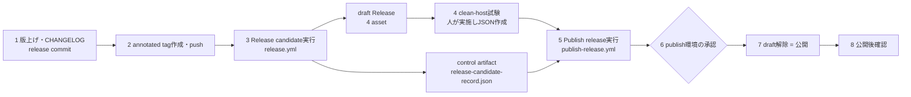

# GitHub.comリリース作成手順書

StudyReport EvaluatorのWindows公開物を、GitHub.com上のGitHub Releaseとして作成・公開する運用手順です。対象読者はリリース担当者です。

- **リリースは自動で公開されません。** [`release.yml`](../../.github/workflows/release.yml)（draft作成）と[`publish-release.yml`](../../.github/workflows/publish-release.yml)（公開）は、どちらも`workflow_dispatch`の手動起動のみです。tag push、`release`イベント、`schedule`、`workflow_run`での自動起動はありません。
- [`ci.yml`](../../.github/workflows/ci.yml)はbuildとtestだけで、Releaseを作りません。
- 版の決め方、`version.ps1`、失敗時の方針は[アプリケーション版管理手順](version-management.md)（以下「版管理手順」）が正本です。この文書は、GitHub.comでの操作を順番に実行するための手順書です。方針や契約は版管理手順、ADR-0014、ADR-0016に従います。
- この文書は手順を定義するもので、特定版の公開済み・clean-host PASSを主張しません。

## 1. 全体像



| 段階 | 実行者 | 場所 | 成果 |
|---|---|---|---|
| 1〜2 | リリース担当 | ローカルPC | release commitと`vX.Y.Z` annotated tagをremoteへpush |
| 3 | リリース担当 | Actions: **Release candidate** | draft Release（4 asset）、candidate control artifact。status `PASS_CANDIDATE`（非公開扱い） |
| 4 | clean-host担当（人） | 別のfresh Windows 11 x64 | CH-01〜06のclean-host証跡JSON |
| 5〜7 | リリース担当＋承認者 | Actions: **Publish release** | protected environment `publish`の承認後にdraftを公開 |
| 8 | リリース担当 | GitHub.com | 公開後確認 |

公開assetは次の**4件固定**です。control artifactは公開assetに含めません。release matrix v2はEXE行とZIP行の2行だけです（開発用 MSIX と macOS の基盤は 2026-10-06 に廃止した）。

- `StudyReportEvaluator-win-x64.exe`
- `StudyReportEvaluator-win-x64.exe.sha256`
- `StudyReportEvaluator-win-x64.zip`
- `StudyReportEvaluator-win-x64.zip.sha256`

## 2. 前提条件

### 2.1 ローカル

- Windows 11 x64、PowerShell 7.5以上（`pwsh`）、.NET SDK 10.0.400（[release.yml](../../.github/workflows/release.yml)と同じ版）、`git`、`gh`（`gh auth login`済み）。
- 作業ツリーがcleanであること。
- private sample（`sample/`）はGit管理外のままにします。`sample/`配下がtrackされているとcandidateは失敗します。

### 2.2 GitHub.comリポジトリ

- Actionsが有効で、`Release candidate`と`Publish release`が有効なこと。
- Environment **`publish`**（Settings → Environments）にRequired reviewersが設定されていること。公開はこの承認が前提です。現在はreviewerに`dahatake`が設定されています。Prevent self-reviewは無効です。
- workflowの権限は各yml側で`contents: write`（publishは`actions: read`も）を宣言しています。organizationまたはrepositoryの既定Workflow permissionsで拒否されていないことを確認します。
- Immutable Releasesを利用できる場合は、**初回公開前に**Settings → Generalで有効化を確認します。公開後のtag移動とasset差替えを防ぎます。[GitHub Docs: Immutable releases](https://docs.github.com/en/code-security/concepts/supply-chain-security/immutable-releases)

### 2.3 対象は安定版のみ

`release.yml`と`publish-release.yml`は、tagが`^vMAJOR.MINOR.PATCH$`（prerelease／buildメタデータなし）の場合だけ受理します。prerelease（例: `v1.0.0-rc.1`）は現行workflowでは作れません。作る場合は、先にworkflow変更を別decisionとして行います（版管理手順 §6.7）。

## 3. 手順

`X.Y.Z`は公開する版に置き換えます。

### 手順1: 版とCHANGELOGを更新し、release commitを作る

詳細は版管理手順 §6.1〜§6.6です。要点は次のとおりです。

```powershell
pwsh.exe -NoLogo -NoProfile -File .\dev\version.ps1 show
pwsh.exe -NoLogo -NoProfile -File .\dev\version.ps1 set X.Y.Z -DryRun   # または bump patch|minor|major -DryRun
pwsh.exe -NoLogo -NoProfile -File .\dev\version.ps1 set X.Y.Z
pwsh.exe -NoLogo -NoProfile -File .\dev\version.ps1 verify
```

1. [`CHANGELOG.md`](../../CHANGELOG.md)の`[Unreleased]`の内容を、`## [X.Y.Z] - YYYY-MM-DD`へ移します。空の`[Unreleased]`を先頭に残します。日付付きの見出しがちょうど1件必要です。**この節の本文がそのままGitHub Releaseのrelease notesになります**（`StudyReport Evaluator X.Y.Z`の見出し付き）。回答、Prompt、学生data、credentialを書きません。
2. ローカルでlocked restore、Release build、testを通します（版管理手順 §6.4）。
   ```powershell
   dotnet restore .\StudyReportEvaluator.slnx --locked-mode
   dotnet build .\StudyReportEvaluator.slnx --configuration Release --no-restore
   ```
3. version、履歴、code、testを含むrelease commitを作り、`main`へpushします。CIが成功していることをGitHub.comで確認します（最新のCIが失敗している状態でtagを作りません）。

> `sample/SampleReport.xlsx`を使うmanual final gateはCIで代用できません。正式公開前にWindows 11 x64で実施します（版管理手順 §6.4）。

### 手順2: annotated tagを作成しpushする

tagは**release commitを指すannotated tag**でなければなりません（lightweight tagは拒否されます）。

```powershell
git switch main
git pull --ff-only
git status --porcelain            # 出力が空であること
git tag -a vX.Y.Z -m "StudyReport Evaluator X.Y.Z"
pwsh.exe -NoLogo -NoProfile -File .\dev\version.ps1 verify -Tag vX.Y.Z -RequireClean
git push origin main
git push origin vX.Y.Z            # 通常のgit pushはtagを送らない
git ls-remote --tags origin vX.Y.Z
```

`verify -Tag`は、`CHANGELOG.md`の節が1件、tag名が`v`＋製品版と一致、annotated、tagが現在のHEADを指す、作業ツリーがcleanであることを確認します。

### 手順3: Release candidateを実行する（draft作成）

**GitHub.com:** Actions → **Release candidate** → Run workflow → `tag`に`vX.Y.Z`を入力して実行します。

**CLI:**

```powershell
gh workflow run release.yml --repo dahatake/StudyReport-Evaluator --ref main -f tag=vX.Y.Z
gh run list --workflow release.yml --repo dahatake/StudyReport-Evaluator --limit 3
gh run watch <run-id> --repo dahatake/StudyReport-Evaluator --exit-status
```

- workflowは`tag`をcheckoutします。Run workflowのブランチ選択（`--ref`）はworkflow定義の取得元で、ビルド対象は`tag`です。`--ref`はtag作成commitを含むブランチ（通常`main`）を選びます。
- windows-latestで最大120分です。実測は約15分です。
- 同一tagの同時実行はconcurrencyで直列化されます。

workflowが行うこと:

1. tagの実在、tagとcheckout commitの一致、annotated、作業ツリーclean、`sample/`が未追跡であること、`version.ps1 verify -Tag`、CHANGELOG節の存在を検証します。
2. locked restore、Release build、決定的test、ZIP回帰、single-file（EXE）のpublish／package／required test、published binaryの版検証を実行します。
3. `build-platform-release-matrix.ps1 -Mode Candidate`でcandidate recordを作ります。
4. Artifactを保存します（保持30日）。
   - `release-candidate-<tag>-<run-id>`: control evidence（`release-candidate-record.json`、EXE/ZIP evidence）
   - `release-assets-<tag>-<run-id>`: 公開4 asset
   - `release-test-results-<run-id>`: trx
5. **draft** GitHub Releaseを作成します（`--draft --verify-tag`）。題名は`StudyReport Evaluator X.Y.Z`、本文はCHANGELOGの該当節です。4 assetだけが添付され、それ以外があれば失敗します。

成功後の確認:

```powershell
gh release view vX.Y.Z --repo dahatake/StudyReport-Evaluator --json isDraft,assets,targetCommitish
```

- `isDraft`が`true`、assetが上記4件だけであること。
- run IDを控えます。**手順5の`candidate_run_id`に使います**。
- **`PASS_CANDIDATE`は公開不可です。** clean-host試験と保護された公開workflowが未実施です。

> 既に同名のReleaseがある場合、このworkflowは「replaceしない」として失敗します。既存のdraftは自動では上書きされません（§4）。

### 手順4: clean-host試験を実施し証跡JSONを作る

candidateの**exact EXE**（手順3のdraftまたは`release-assets-*` artifactのEXE）を、fresh Windows 11 x64（標準ユーザー）で人が試験します。試験項目は[ADR-0016](adr/0016-windows-one-action-startup.md)のCH-01〜06です。

| ID | 内容（要約） |
|---|---|
| CH-01 | fresh OS。追加の.NET SDK／Runtime、PowerShell 6+、Node／npm、Git／gh、別CLI、Office、IDEが未導入 |
| CH-02 | EXE単体でoffline GUI起動、Excel読込、設計 |
| CH-03 | 外部ツールなしで同梱CLIのStart／Ping／認証状態確認 |
| CH-04 | 移動・再起動・同時起動、args／任意cwd、日本語・空白path、read-only配置先、data保護 |
| CH-05 | ブラウザー取得のMOTW付きEXE、SmartScreen／SAC／企業policyの警告・拒否と実操作数 |
| CH-06 | fresh userの本人login、再確認、取消／終了時の所有processだけの終了 |

- CH-01〜06は**すべて必須PASS**です。`ADV-01`（実AI評価）と`ADV-02`（外部再計算）は任意で`NOT_RUN`可です。
- SmartScreenやWindows保護機能を無効化・回避して成功にしません。拒否された場合はFAILまたは公開保留として記録します。
- **証跡JSON**は、スキーマ[`platform-release-matrix-v2.schema.json`](../../eng/schemas/platform-release-matrix-v2.schema.json)の`cleanHostEvidence`に従います。
  - 主な項目: `schemaVersion`（`1`）、`evidenceKind`（`windows-singlefile-clean-host`）、`measuredAtUtc`、`productVersion`、`sourceCommit`、`candidate`（repository、run ID）、`package`（EXE名、bytes、SHA-256）、`runtime`、`host`（OS edition／build／architecture）、`protection`、`measurements`、`tests`（CH-01〜06、ADV-01、ADV-02の8件。各`id`／`status`（`PASS`／`FAIL`／`NOT_RUN`）／`operations`／`record`）
  - `candidate`、`package`、`runtime`は手順3のcandidate record・EXE evidenceと一致させます。一致しないと公開workflowが拒否します。
  - username、credential／device code、学生本文、Prompt、環境変数値一覧、生ログは**含めません**。製品repositoryへcommitもしません。
  - UTF-8（BOMなし）、**64 KiB以下**の1つのJSONです。

> 公開workflowはJSONを検証・束縛するだけで、試験が実施された事実は人の記録に依存します（ハッシュ一致は人の実施を証明しません）。EXEのbytesが変わった場合（再ビルド、docs同梱、PATCH変更）は、旧結果を流用せず再試験します。

### 手順5: Publish releaseを実行する

**GitHub.com:** Actions → **Publish release** → Run workflow で次を入力します。

| 入力 | 値 |
|---|---|
| `tag` | `vX.Y.Z`（draftのtag） |
| `candidate_run_id` | 手順3のRelease candidateのrun ID（数字） |
| `clean_host_evidence_json` | 手順4のJSON本文（1行または整形済みのままそのまま貼り付け） |

**CLI:**

```powershell
$json = Get-Content -LiteralPath .\clean-host-evidence.json -Raw -Encoding utf8
gh workflow run publish-release.yml --repo dahatake/StudyReport-Evaluator --ref main `
    -f tag=vX.Y.Z -f candidate_run_id=<run-id> -f clean_host_evidence_json="$json"
```

workflowの唯一のjobは`environment: publish`で実行されるため、**最初のstepの前に承認待ちで停止します**。承認（手順6）後に次の検証が始まります。

検証内容（すべてfail-closed）:

1. tagの実在、annotated、tag＝checkout commit、作業ツリーclean、`version.ps1 verify -Tag`、CHANGELOG節。
2. `clean_host_evidence_json`が空でなく、UTF-8で64 KiB以下であること。
3. `candidate_run_id`のrunが、同一repositoryの`release.yml`の`workflow_dispatch`実行で、`success`、tag commitの`head_sha`と一致すること。control artifact（3ファイル）が有効期限内に1件だけあること。
4. draft Releaseが実在し、tag一致、assetが4件だけであること。
5. draftの4 assetと、candidate control evidence、受領clean-host JSONから`build-platform-release-matrix.ps1 -Mode Final`で最終matrix（v2）を作ります。`release-final-control-<tag>-<run-id>` artifactに保存されます（公開assetには含まれません）。
6. 公開直前に、draftの4 assetを再downloadし、`validate-platform-release-matrix.ps1`（C02）でsource／version／hash／sidecar／candidate runを再検証します。asset ID・size・digest・updatedAtが検証前後で変わっていないことも確認します。

### 手順6: 公開を承認する

1. GitHub.comのrun画面に「Review pending deployments」が表示されます。reviewer（`publish`環境のRequired reviewers）が確認します。
2. 承認は自動検証より前に行われます。承認者は、入力した`candidate_run_id`が対象tagのものか、clean-host JSONの`productVersion`／`sourceCommit`／EXE SHA-256が手順3の成果物と一致するか、CH-01〜06がすべて`PASS`かを人の目で確認します（run画面の入力値で確認できます）。
3. 問題がなければ**Approve and deploy**、問題があれば**Reject**します。承認後も、手順5の自動検証に1つでも失敗すれば公開されません。

### 手順7: 公開（draft解除）

承認後、手順5の再検証をすべて通過した場合にだけ、最後のwrite操作として`gh release edit vX.Y.Z --draft=false`が実行されます。公開後にasset identityが変わっていた場合は、自動でdraftへ戻して失敗にします。

### 手順8: 公開後の確認

```powershell
gh release view vX.Y.Z --repo dahatake/StudyReport-Evaluator --json isDraft,isPrerelease,tagName,assets,url
gh release list --repo dahatake/StudyReport-Evaluator --limit 3
```

1. `isDraft=false`、4 assetの名前・サイズが手順3と一致し、`tagName`が`vX.Y.Z`であること。Latestになっていること。
2. `.sha256`とダウンロードしたEXE／ZIPのSHA-256が一致すること。
   ```powershell
   gh release download vX.Y.Z --repo dahatake/StudyReport-Evaluator --dir .\verify
   (Get-FileHash .\verify\StudyReportEvaluator-win-x64.exe -Algorithm SHA256).Hash
   Get-Content .\verify\StudyReportEvaluator-win-x64.exe.sha256
   ```
3. 実在するdownload URLを確認してから、利用者文書（README等）へ記載します。公開前にURLやclean-host成功を書きません。
4. 実施結果（run ID、承認者、日時）を、別途execution recordなどへ残します。この文書へ特定版の実績は追記しません。

## 4. 失敗時の対応

方針は版管理手順 §8です。GitHub Actions固有の対応は次のとおりです。

| 症状 | 原因の例 | 対応 |
|---|---|---|
| Release candidateが`Only stable release tags...`で失敗 | tagがprerelease形式など | 安定版のtagを使う。§2.3参照 |
| `must point to the checked-out commit` | tagが誤ったcommitを指す。または`--ref`の選択ミス | 未共有のtagなら原因確認後に作り直す。共有済みなら新しいPATCHにする（tagを黙って移動しない） |
| `must be annotated` | lightweight tag | `git tag -a`で作り直す（未共有の場合のみ） |
| `CHANGELOG.md does not contain a dated...` | 節の見出しがない・日付形式が違う | 手順1を修正し、新しいcommit／tagで再実行 |
| `Release vX.Y.Z already exists; this workflow never replaces a release.` | 前回のdraftまたは公開Releaseが残っている | 公開済みなら差し替えず新しい版にする。誤ったdraftなら、内容を確認後にGitHub.comまたは`gh release delete vX.Y.Z`でdraftを削除して再実行。**tagは別途扱う**（削除・移動は共有状況を確認） |
| Release candidateのtest／package失敗 | コードまたは環境 | ログ（`release-test-results-*`のtrx）で原因を修正し、新しいcommitとtagで再実行。**candidate成果物を手で差し替えない** |
| `Release builds require .NET SDK 10.0.400 exactly` | 専用install先へ固定SDKを導入できない、またはPATH先頭のSDKが別patch | `Set up .NET`の`DOTNET_INSTALL_DIR`と導入logを確認する。C02/P07証跡はSDK `10.0.400`へ束縛され、runner既定の新しい`10.0.4xx`（`latestPatch`）で作った証跡は`C03_C02_VALIDATION`になる |
| Publishが`The candidate run must have succeeded for the exact tagged commit.` | 誤った`candidate_run_id`、失敗run、tag移動後のrun | 対象tagで成功したRelease candidateのrun IDを指定 |
| candidate control artifactが見つからない | 30日の保持期限切れ | Release candidateを再実行（新draftが必要ならdraft削除後） |
| `The draft must carry exactly EXE/ZIP assets...` | assetの追加・削除・混入 | draftを手で編集せず、正しいdraftを作り直す |
| clean-host JSONが不正／C02検証失敗 | 版・commit・hash・run IDの不一致、CHのFAIL／NOT_RUN | 手順4のJSONを作り直す（EXEが変わったなら再試験）。公開しない |
| Approveをrejectした・タイムアウト | — | 公開されない。draftはそのまま残る。原因解消後にPublishを再実行 |
| `Post-publication verification failed; the release was restored to draft state.` | 公開後にasset identityが変化 | draftへ自動的に戻る。原因を調査し、再度Publishを実行 |

公開後に問題を見つけた場合は、公開済みのtag・asset・sidecarを差し替えず、新しいPATCH/MINOR/MAJORとして修正版を作ります（版管理手順 §8.4）。

## 5. チェックリスト

- [ ] 版・CHANGELOG・release commitが`main`にあり、CIが成功している（手順1）
- [ ] `vX.Y.Z` annotated tagをpushし、`ls-remote`で確認した（手順2）
- [ ] Release candidateが成功し、draftに4 assetだけがある（手順3）
- [ ] fresh Windows 11 x64でexact EXEのCH-01〜06が全PASSとなり、JSONを作成した（手順4）
- [ ] Publish releaseにtag、run ID、JSONを入力した（手順5）
- [ ] `publish`環境の承認前に内容を確認し、承認した（手順6）
- [ ] Releaseが公開され、4 assetのSHA-256を確認した（手順7〜8）
- [ ] 利用者文書へ実在URLだけを記載した（手順8）

## 6. 関連文書

- [アプリケーション版管理手順](version-management.md)（SemVer、`version.ps1`、tag、failure handling）
- [ADR-0014 製品版管理](adr/0014-product-versioning.md)
- [ADR-0016 Windows単一EXE・clean-host公開境界](adr/0016-windows-one-action-startup.md)
- [Traceability — Final gate prerequisites](traceability.md#final-gate-prerequisites)
- [GitHub Docs: Managing releases](https://docs.github.com/en/repositories/releasing-projects-on-github/managing-releases-in-a-repository)
- [GitHub Docs: Reviewing deployments](https://docs.github.com/en/actions/managing-workflow-runs-and-deployments/managing-deployments/reviewing-deployments)
