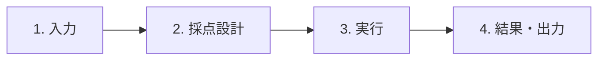
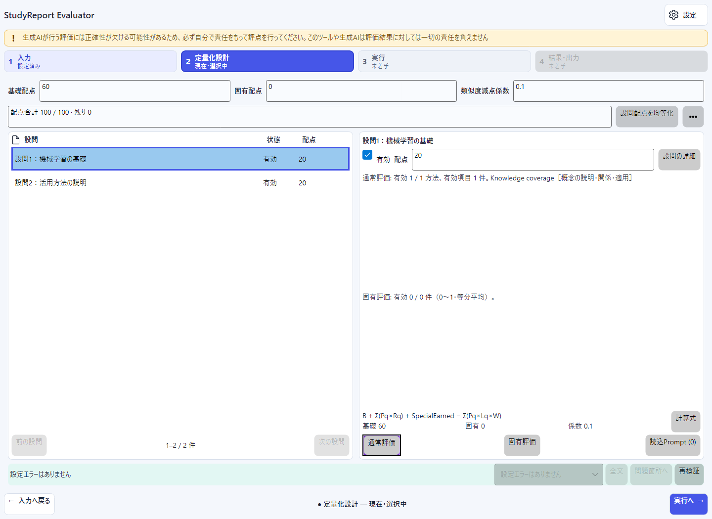
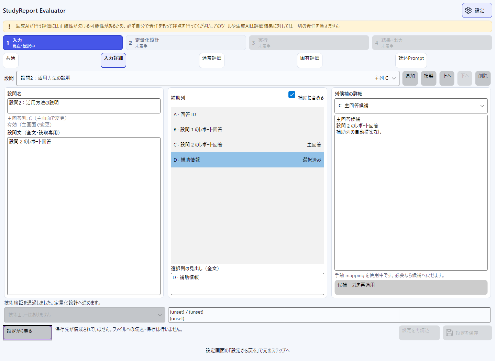
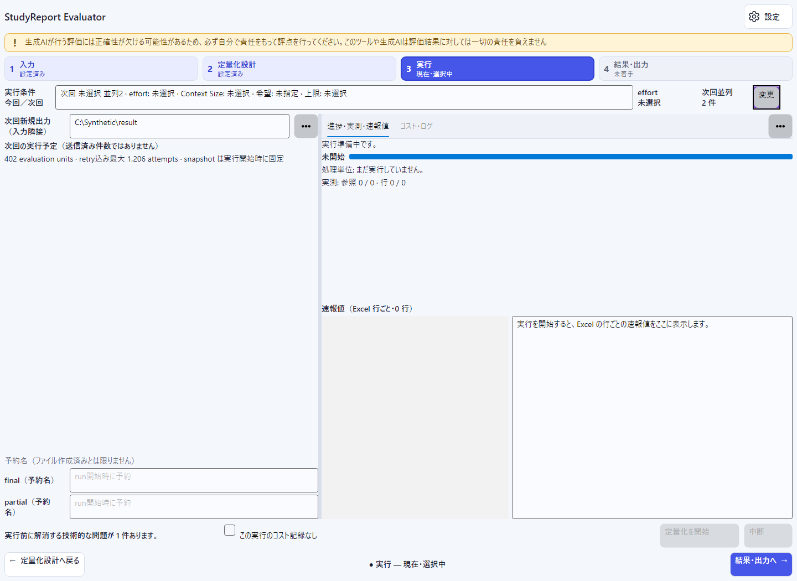
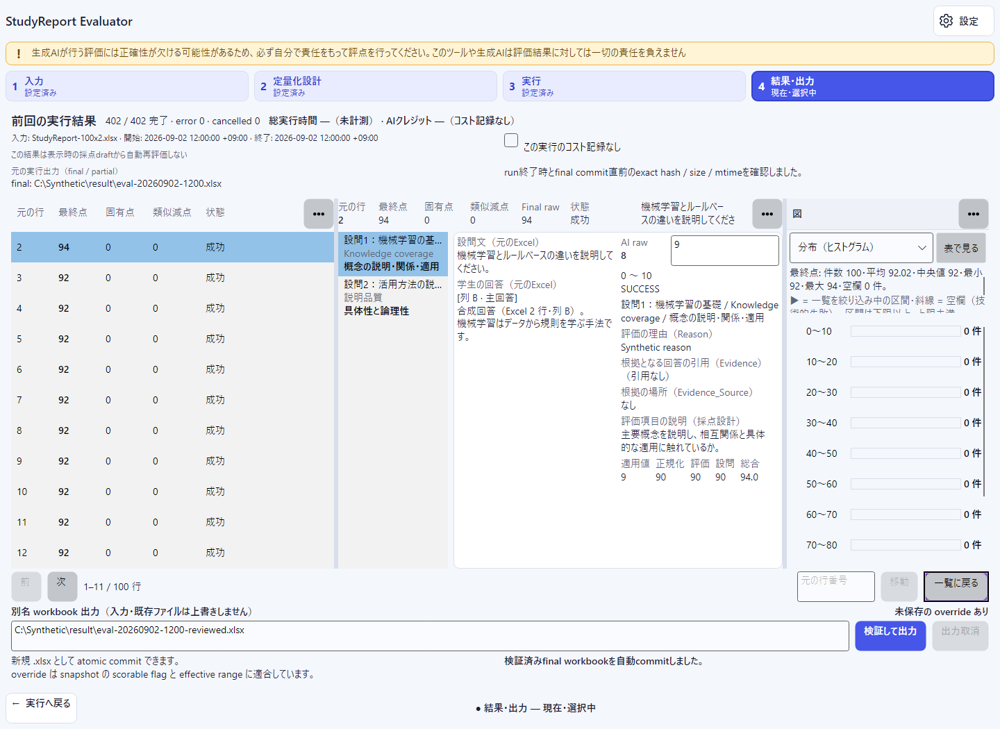

# はじめに

このガイドでは、Windows 11 x64でStudyReport Evaluatorを起動し、標準`.xlsx`から最初の結果workbookを作る手順を説明します。

本アプリの製品版は`0.9.0`です。`0.9.0`は前版（`dahatake/StudyReport-Evaluator`）の公開`v0.8.6`の後継で、このリポジトリのGitHub Releasesから配布しますが、まだ公開していません。

現在入手できる公開版は、前版の`v0.8.6`です。[GitHub Releases](https://github.com/dahatake/StudyReport-Evaluator/releases/tag/v0.8.6)で取得できる`StudyReportEvaluator-win-x64.exe`、`StudyReportEvaluator-win-x64.exe.sha256`、`StudyReportEvaluator-win-x64.zip`、`StudyReportEvaluator-win-x64.zip.sha256`の4件が公開assetです。単一EXEが主導線で、ZIPは代替経路として維持します。旧`v0.8.1`は前版の前回公開版です。

> [!WARNING]
> 生成AIが行う評価には正確性が欠ける可能性があるため、必ず自分で責任をもって評点を行ってください。このツールや生成AIは評価結果に対しては一切の責任を負えません

> [!IMPORTANT]
> 以下の操作は製品版`0.9.0`（未公開）向けです。単一EXE、login button、簡素化UI・設定保存は前版の公開`v0.8.6`と共通で、パネルの配置変更・ペルソナ・図は`0.9.0`で追加しました。`0.9.0`のclean-host試験CH-01〜06と本人loginはまだ実施しておらず、公開前に実施します。`v0.8.6`はrepository ownerの明示判断により、**fresh Windowsのclean-host試験CH-01〜06と本人loginを実施しないまま公開**しました。追加ソフト未導入のOS-only環境での動作、Narrator／本人walkthrough／隔離利用者設定保存、T39の完了を実証済みとはしていません。旧`v0.8.1`の操作と区別してください。既存の検証状況と画像の対象版は本ガイド末尾を参照してください。

**前版から移行する場合:** 設定の保存先は前版と同じ`%LOCALAPPDATA%\StudyReportEvaluator\setting.txt`で、前版で**設定を保存**した設定をそのまま読み込みます（読込でファイルは変わりません）。**前版と同時に使うと、同じ設定ファイルを共有します。** 前版で中断したcheckpointは、再開条件をすべて満たす場合だけ再開できます。詳しくは[README](../README.md#前版v086からの移行と設定ファイルの共有)を参照してください。

## 準備

必要なもの:

- Windows 11 x64の標準user環境
- 下記の対象版に合った配布物（主導線は単一EXE、ZIPは代替経路）
- 評価対象の標準`.xlsx`
- AI処理を行う場合だけ、利用可能なGitHub Copilot account、本人の対話login、network接続、利用可能model、組織policy上の利用許可

GUI起動に.NET Runtime／SDK、PowerShell、Node.js／npm、Git、GitHub CLI（`gh`）、別Copilot CLI、Microsoft Excel／Office／LibreOffice、IDEの導入を要求しないself-contained設計です。Copilot CLIは配布物へ同梱され、PATH上の別CLIへfallbackしません。GUI起動とAI利用の前提は別です。

配布形式は単一EXEとZIPだけです。開発用 MSIX と macOS の基盤は 2026-10-06 に廃止した。

## 単一EXEから起動する（v0.8.6の主導線）

1. [`StudyReportEvaluator-win-x64.exe`](https://github.com/dahatake/StudyReport-Evaluator/releases/download/v0.8.6/StudyReportEvaluator-win-x64.exe)をdownloadします。
2. 任意・推奨のhash確認を行う場合は、同じreleaseの[`StudyReportEvaluator-win-x64.exe.sha256`](https://github.com/dahatake/StudyReport-Evaluator/releases/download/v0.8.6/StudyReportEvaluator-win-x64.exe.sha256)も取得し、下記の方法で照合します。
3. `StudyReportEvaluator-win-x64.exe`をダブルクリックします。
4. 入力画面が表示されたら、本ガイドの「1. 入力」へ進みます。

**ダブルクリックを1起動gestureと数えます。** download、任意の手動hash比較、Windowsの警告への操作、本人loginはこの1操作に含めません。警告・拒否や追加操作を隠して、無条件に1操作で起動できるとは表示しません。

標準userがofflineでGUI、Excel読込、mapping、採点設計を利用できることを要求しています。ただし、**fresh OS-only環境での実証は未完了**です。手動展開、setup script、terminalへのcommand入力、管理者昇格、repository、隣接DLL／manifest、既存CLI cache・認証情報、sidecarをGUI起動の前提にしません。起動時にloginやAI評価は自動開始しません。

repository内の`artifacts`を一般配布先として扱わず、公開`v0.8.6`のGitHub Release assetを利用してください。

## ZIPを起動する（v0.8.6の代替経路）

1. [`StudyReportEvaluator-win-x64.zip`](https://github.com/dahatake/StudyReport-Evaluator/releases/download/v0.8.6/StudyReportEvaluator-win-x64.zip)をdownloadします。
2. 任意・推奨のhash確認を行う場合は、同じreleaseの[`StudyReportEvaluator-win-x64.zip.sha256`](https://github.com/dahatake/StudyReport-Evaluator/releases/download/v0.8.6/StudyReportEvaluator-win-x64.zip.sha256)も取得し、下記の方法で照合します。
3. ZIPを新しいdirectoryへ展開します。
4. `StudyReportEvaluator-win-x64\StudyReportEvaluator.App.exe`を起動します。

旧`v0.8.1`の配布物は履歴として残りますが、現在の案内は`v0.8.6`の4 assetを対象にします。

## SHA-256を確認する（手動比較は任意・推奨）

EXE／ZIPそれぞれのsidecar公開と、CI・公開判定での最終配布bytesとのSHA-256完全一致確認は必須です。一方、**利用者の手動hash比較は任意の推奨であり、sidecarはアプリ起動の依存fileではありません。** 確認のためだけにPowerShell等を導入する必要はありません。

確認する場合は、取得したEXEまたはZIPのSHA-256を、同じrelease・同じ形式のsidecarの先頭64文字と照合してください。不一致なら実行せず、正式配布元からの再取得を確認します。同じ配布元のhash一致だけでは、発行者の真正性やSmartScreen reputationは保証されません。

PowerShell 7が既にある場合の、公開ZIPのSHA-256確認例（任意）:

```powershell
(Get-FileHash -Algorithm SHA256 .\StudyReportEvaluator-win-x64.zip).Hash
```

Windows 11標準の`certutil`の`-hashfile`機能でも、取得した配布fileを指定し、アルゴリズムを`SHA256`として確認できます。単一EXEを確認する場合は対象を`StudyReportEvaluator-win-x64.exe`とし、EXE用sidecarと照合します。どちらの確認方法もGUI起動の必須操作ではありません。

## Windowsの警告・実行拒否

公開EXEとZIPはunsignedです。SmartScreen、Smart App Control（SAC）、企業policyによる警告・実行拒否があり得ます。code signing済み、installer形式、SmartScreen reputation確立済み、すべての端末で無警告とは表示しません。

入手元を確認できない場合やhashが不一致の場合は実行しないでください。保護機能が実行を拒否した場合は停止し、所属組織の管理者に確認してください。保護機能の無効化、MOTW除去、証明書の自動trust、execution policy変更、UAC回避は案内しません。

## 単一EXEの標準展開と残存cache

単一EXEの内容は.NET標準hostが、通常は標準userの一時領域`%TEMP%/.net/<app>/<bundle-id>/`へ展開します。展開先の書込権限と空き容量が必要です。cacheは終了後も残り、再利用され得ます。**1ファイル配布は「ディスク上も1ファイル」「痕跡なし」ではありません。** 独自のcache管理UIや自動掃除はありません。

cacheはアプリ配置用で、入力workbook、final／partial、利用者別設定、CLI credential storeとは別です。**新規runの明示出力先が未指定（`null`）の場合だけ、入力fileに隣接する`result`**を使います。保存した明示出力先は再起動・入力変更後も保持し、EXE配置先や抽出cacheを既定先にしません。配布・展開・起動のために利用者workbookを移動・削除しません。アプリは抽出cacheの再帰削除やCLI credentialの削除も行いません。

## 4stepの流れ



主画面は入力・配点・実行判断・結果の確認に絞っています。詳細は同じウィンドウの**設定**で編集します。設定は第5ステップではなく、**共通／入力詳細／通常評価／固有評価／読込Prompt**の5カテゴリです。[設定ガイド](settings.md)に操作と保存範囲をまとめています。

- **入力詳細…**、**通常評価**などの入口から、選択中の同じ設問を開けます。**設定から戻る**で元ステップへ戻り、値・対象・表示ページ・入力途中の編集を保持します。呼出元の操作が残っていて利用可能なら、そこへフォーカスも戻ります。
- 設問はコンパクト一覧とページ切替で**全件へ到達**できます。詳細カードを全件同時表示する方式ではありません。表示範囲と全件数を確認し、必要なページ・設問を選びます。1ページの表示件数は画面の残領域に応じて変わり、設問数の上限ではありません。
- 「設定済み」は準備完了や処理成功ではありません。画面移動・設定編集だけでは認証確認、login、AI評価、設定fileへの保存を行いません。
- **2 採点設計**・**3 実行**・**4 結果・出力**の内容はパネルに分かれ、各パネルの**…**（パネルの操作）メニューで、ドラッグせずに移動・大きさ・タブ・表示・最大化を変えられます。崩れたときは**既定のレイアウトに戻す**で戻せます。**Ctrl+Shift+P**のコマンド検索や**Alt+1〜Alt+4**のステップ移動も使えます。詳しくは[パネルの配置とコマンド検索](features.md#パネルの配置とコマンド検索)を参照してください。
- 初回は「P-01 採点担当教員」の配置で、**4 結果・出力**は左に結果一覧、中央に詳細、右に図が並びます。**設定 → 共通 → ペルソナ**で変えられます（[ペルソナとパネル配置](settings.md#ペルソナとパネル配置layoutjson)）。

## 1. 入力


1. **ファイルを選択**でnative pickerを開くか、**ファイル path（標準 .xlsx）**へfull pathを入力し、**read-only で読込**を選びます。
2. **回答 sheet**、**質問文の行**（1または2）、**回答開始行／回答終了行**を確認します。
3. 設問一覧の前後ページ、または全設問を選べる**設問**欄から対象を選び、**有効**、**主回答列**、**設問文（必須）**を確認・編集します。
4. 設問名・補助列・候補・追加／複製／並替え／削除は**入力詳細…**から設定で編集します。保存定義を再利用する場合は、Excel読込後に[保存定義を明示適用](settings.md#保存定義を現在の入力へ適用する)します。
5. 技術エラーの対象と内容を確認し、**問題箇所へ**などから対応する画面で修正します。

主回答列を選択すると、選択中sheetの**質問文の行と同じ列が交差する1セル**の値を**設問文（必須）**へ即座に反映します。手入力後に主列を選び直すと置き換わり、交差セルが空なら設問文も空になります。回答行や列全体を連結する動作ではありません。

候補mappingは出発点です。列位置だけで役割を確定せず、見出しと授業設計に合わせて変更してください。同じ設問内で主回答列と補助列を重複させることはできません。**質問文の行**を変えたら**見出し行を再読込**します。再読込前は旧行の値で質問文を上書きせず、現在の文を保持して不一致を通知します。

## 2. 採点設計



1. **基礎配点**（Base points、既定60）、**固有配点**（Special points、既定0）、**類似度減点係数**（既定0.1、範囲0〜1）を設定します。
2. **前の設問／次の設問**で全設問の有効状態と配点を確認し、選択した設問の**有効／配点**を編集します。ページを切り替えるだけでは編集中の設問を変更しません。
3. 通常評価・固有評価の概要と**計算式**を確認します。詳細編集は**通常評価／固有評価／読込Prompt（件数）**から設定へ進み、**設定から戻る**で確認を続けます。定義名・revision・丸め桁数は**設定 → 共通 → 共通設定**にあります。

配点合計は、表示ページ外を含む全有効設問について次を**正確に**満たす必要があります。

$$
BasePoints + SpecialPoints + \sum_{q=1}^{N} QuestionPoints_q = 100
$$

各$QuestionPoints_q$は絶対配点、$N$は有効な設問数です。**設問配点を均等化**は明示操作した場合だけ手動配点を置き換えます。設問追加やBase／Special変更だけでは自動調整しません。

丸め桁数は0〜6で、表示だけでなく計算の各段階に影響します。通常評価率・類似度・固有評価平均は実行時に求め、設計画面で学生の仮点は生成しません。技術エラーや数値の未反映表示があれば修正し、概要の確定値を確認してください。

**配点構成**パネルを表示すると（パネルの**…** → **表示するパネル**、またはペルソナ「P-02 評価設計担当」）、基礎配点・固有配点・各設問の配点の積み上げ棒と合計100の基準線、「差分 −0.5」のような合計との差を数値で確認できます。差分は検証エラーと同じ値です。詳しくは[配点構成の図](features.md#配点構成の図2-定量化設計の配点構成パネル)を参照してください。

評価項目・range・weight・Promptの操作は[設定ガイド](settings.md)、Promptの記述規則は[Custom evaluator](custom-evaluator-guide.md)、起動時の読込は[Promptファイルから起動](prompt-launch.md)を参照してください。Promptの選択・適用・プレビューだけではAI評価を開始しません。

### 「設問の詳細」を押した後の画面（設問の名前・補助列の確認）

設問の一覧の右にある**設問の詳細**を押すと、いま選んでいる設問を対象にした**設定の「入力詳細」画面**が開きます。「この設問は何という名前か」「設問文の全文は何か」「回答のほかに、どの列（学生番号や補足情報など）をAIへの手がかりにするか」を確認・調整する画面です。配点や有効／無効を決める画面ではありません。



上の画像は、合成データの設問2を開いた例です。画面は次の4つの部分に分かれます。

| 場所 | 名前 | 何をする欄か |
|---|---|---|
| 上部 | **設問** | 対象の設問を切り替えます。右に**主列 C**のように、その設問で評価する回答の列（主回答列）が表示されます。**設問の詳細**から開いた直後は、採点設計で選んでいた設問が選ばれています。 |
| 上部右 | **追加／複製／上へ／下へ／削除** | 設問そのものを増やす・コピーする・順番を変える・消す操作です。一番上の設問では**上へ**、一番下の設問では**下へ**が押せません。 |
| 左 | **設問名**・**設問文（全文・読取専用）** | 設問名は結果の画面などで見分けるための呼び名で、ここで書き換えられます。設問文はExcelの質問行から取り込んだ文で、この画面では読むだけです（長い文は欄内をスクロールして全文を読めます）。 |
| 中央 | **補助列**・**補助に含める** | 主回答列とは別に、AIへ参考として渡したい列を選びます。一覧から列（例:「D・補助情報」）を選び、**補助に含める**にチェックを入れると使い、外すと使いません。 |
| 右 | **列候補の詳細**・**候補一式を再適用** | Excelの見出しから自動で見つけた列の候補を確認します。候補を眺めるだけでは設定は変わりません。 |

**基本の使い方**

1. 採点設計で対象の設問を選び、**設問の詳細**を押します。
2. 上部の**設問**が意図した設問か確認します。違うときは、この欄から切り替えます。
3. **設問名**を、授業で使っている呼び名（例:「第3回 活用方法の説明」）に直します。
4. **設問文**が、学生に出した問いと合っているか読んで確認します。合っていない場合は、ここでは直せないので、手順6のあと「1. 入力」へ戻って主回答列を選び直します。
5. 学生番号・提出日時・補足コメントなど、評価の参考にしたい列があれば、中央の一覧で選んで**補助に含める**にチェックを入れます。回答そのものの列（主回答列）は補助列にできません。
6. **設定から戻る**を押して、元の「2. 採点設計」へ戻ります。押した時点では、保存もされず、編集内容の破棄もされません。入力した内容は同じ起動中は保持されます。

**注意してください**

- **候補一式を再適用**は、設問と回答範囲をExcelの見出しから作り直します。手で直した設定や設問文は置き換わるため、必要なときだけ押してください。
- **追加／複製／並べ替え／削除**をしても、配点は自動では調整されません。操作後は「2. 採点設計」へ戻り、配点の合計が100になっているか確認してください。
- **有効／無効**と**主回答列**は、この画面ではなく「1. 入力」で変更します。
- 設定を次回も使いたいときだけ、画面下の**設定を保存**を押します。保存先が用意されていない環境では、ボタンが押せません。
- 設問名などの画面上の変更だけでは、AIの評価は始まりません。

## 3. 実行



実行画面の**モデル・並列度・実効出力先は確認用**です。編集は**変更 → 設定の共通**で行います。**定量化を開始／cancel**は実行画面に残っています。認証確認・login開始／取消、新規／再開の準備は入力画面の**実行の準備を開く**から行います（入力値は保持されます）。

### GitHubにログイン（v0.8.6）

1. 起動直後に、アプリが**このPCで利用中のGitHubアカウントのログインを自動確認**します（同梱CLIが環境変数`COPILOT_GITHUB_TOKEN`／`GH_TOKEN`／`GITHUB_TOKEN`、OSの資格情報ストア、GitHub CLI `gh`のログインの順に探します）。既に利用できるログインがあれば、操作は不要です。
2. 利用できるログインがない場合は、検証済みの同梱native CLIの認証用ブラウザーを**1回だけ自動で開きます**。手動では**GitHubにログイン**を選んでも同じ処理を開始できます。確認だけを手動で繰り返すには**Copilot 状態を確認**を選びます。
3. 本人のaccountで、CLI／ブラウザー上の対話を完了します。アプリへpassword、PAT、token、device codeを入力しないでください。環境変数`STUDY_REPORT_EVALUATOR_AUTO_COPILOT_LOGIN`を`0`または`false`にすると、自動のブラウザー認証だけを止められます。
4. login processが正常終了すると、認証状態とmodel一覧を自動で再確認します。取消・失敗後や自動再確認に失敗した場合は、**Copilot 状態を確認**で再試行します。processの起動・終了codeだけを認証成功とは扱いません。

認証・一覧取得に成功すると、model一覧だけを利用者別`setting.txt`へ自動保存します。未保存の共通設定・採点定義は保存しません。次回起動はキャッシュを表示用に復元し、キャッシュがある場合（空配列を含む）だけ自動再確認します。キャッシュのない旧設定・初回起動は明示確認またはloginを待ちます。キャッシュの表示だけでは評価できません。詳細は[設定ガイド](settings.md#model一覧のキャッシュと自動再確認)を参照してください。

認証とcredential保管は同梱CLI／ブラウザーに委譲します。アプリの認証処理はpassword、PAT、secret、token、device codeを入力・収集・解析・保存・log出力しません。これらを設問文やPromptへ貼り付けないでください。貼付内容は設定の明示保存時に平文で残り得ます。PowerShell等を介したlogin用commandの入力は、この候補版buttonの利用に不要です。

起動時の自動確認・自動login以外では、起動引数、Prompt適用、画面遷移、状態確認からloginを暗黙に開始せず、AI評価は一切自動開始しません。自動loginを取消・失敗した後は、同じ起動中に自動では再試行しません。login後の自動再確認では希望modelが利用可能な場合に実効選択へ反映しますが、別modelへfallbackしません。AI評価は**定量化を開始**を選ぶまで行いません。GUI表示やlogin完了だけではAI利用可能とは判断せず、network、account、列挙されたmodel、組織policy上の許可を別途確認してください。

### loginの取消・失敗（v0.8.6）

**ログインを取り消す**またはアプリ終了で終了・解放するのは、アプリが開始・所有した**当該login CLI processだけ**です。ブラウザー、他のCLI、保存済みcredentialには触れず、logout、credentialの削除・失効も行いません。

loginの二重開始と評価中の開始はできません。取消・失敗後もExcel読込、mapping、設計編集、checkpoint確認は利用できます。表示された理由を確認し、既存の**Copilot 状態を確認**で再確認してから、必要な場合だけloginを再試行してください。

ただし、**login処理の終了を確認できない場合**は旧処理の終了確認までlogin再試行・AI開始を控えてください。アプリの再起動だけでは旧CLIの終了を保証しません。確認不能なら[トラブルシューティング](troubleshooting.md#loginの失敗取消終了処理)の案内に従ってください。

### 同梱CLIで手動loginする（旧公開v0.8.1のみ）

**この手動操作は、login buttonがない旧公開`v0.8.1`のZIP向けです。** 公開`v0.8.6`の通常のGUI起動・login buttonの利用手順ではありません。

1. 展開済みZIP内の`StudyReportEvaluator-win-x64\runtimes\win-x64\native\copilot.exe`を指定して、同梱CLIの対話loginを本人が行います。認証はCLI／ブラウザー上で完了してください。
2. アプリへ戻り、既存の**Copilot 状態を確認**を選びます。

どちらの版でも、CLI欠落・不一致時は正式配布物の再取得／展開状態を確認します。PATH上の別CLIの導入やhash検証の緩和で回避しないでください。別途.NET、PowerShell、Node.js、Git／`gh`、CLIを導入する案内ではありません。

### 新規run

1. **Copilot 状態を確認**を選びます。未認証なら上記の対象版に合ったlogin手順を行い、再確認します。
2. 候補版では**変更 → 共通 → 共通設定**で、ログイン後に利用できる全**通常モデル**、**思考レベル**、**Context Size**、**並列度**（1〜16、既定8）、**指定出力先**を確認・変更します。思考レベルは対応値だけ選べ、非対応モデルでは未指定です。Context Sizeは入力tokenの枠で、拡張対応モデルだけ大きい枠も選べます。高い思考レベルや拡張contextで使用量が変わる場合があります。変更だけでは評価を開始しません。選択はモデル別に保持し、次回起動でも使う場合は**設定を保存**してください。保存希望model・選択値が利用不可なら別値へfallbackせず、選び直しを求めます。
3. **設定から戻る**で実行画面へ戻り、実効model、次回runのreasoning effort、並列度を確認します。入力画面の**実行の準備を開く**で**checkpoint から再開**をoffにします。
4. **次回新規runの実効出力先**、実行予定、技術検証を確認します。指定出力先が空欄の場合だけ入力隣接`result`となり、利用できない指定先から別pathへ自動退避しません。
5. **定量化を開始**を選びます。設定を次回起動にも残すには別途**設定を保存**が必要ですが、設定fileの保存自体はrun開始操作ではありません。

run開始時に入力・採点定義・実効model・並列度・出力条件を固定し、finalとpartialの未使用名を予約します。

実行中は、右列の**実測**（参照・行の進捗）の直下に**速報値**が表示されます。左の一覧には対象のExcel学生行が`Excel 行 N`として先頭行から末尾行まで全件並び、各行の状態（待機中／評価中／完了／中断／未処理／再開前に完了）、完了した項目数、`通常 8,6 / 固有 0.8 / 類似 0.42`のような生の定量値が出ます。行を選ぶと（選ばない場合は評価中の行）、右の欄に、その行で評価に使った**対象の文字列**（主回答・補助列のセル値）、AIへ送った**Prompt**全文、返ってきた**定量値**と理由・根拠が項目ごとに表示され、全文を選択・コピーできます。空回答・固有配点0・技術失敗・取消は値を作らず、その旨を表示します。checkpointから再開した行は、保存済みの値だけを表示します（本文・Promptは保存していません）。これは最終評点ではなく、配点とFinalScoreはExcel数式が計算します。表示内容は画面だけに置き、次のrun・入力の変更・アプリ終了で消えます。

- final: `eval-yyyyMMdd-HHmm[-NN].xlsx`
- partial: `eval-yyyyMMdd-HHmm[-NN].partial.xlsx`

処理順は参照回答生成、学生行評価、checkpoint保存、finalizationです。**予約名の表示はfile作成・保存成功ではありません。** 実行予定、処理単位の完了数、参照回答数、学生行数、実際のAI送信回数も区別します。全処理と検証が成功するとfinalを自動作成します。実行画面を表示中なら結果へ進みますが、設定表示中は設定を閉じません。

### 今回ジョブのコストを確認する

実行中または終了後に、実行画面下部のコスト要約を選ぶと、**コスト詳細**と**ジョブログ**を表示できます。結果画面でも、同じ実行のコスト要約から最終値を確認できます。

- 表示する数値は入力・出力token、利用可能な推論・cache内訳、SDKが報告した`nano-AI units`と、それを1,000,000,000で割った**AIクレジット**（小数4桁）、premium request消費量です。
- `—（未取得）`はSDKから値を観測できなかった状態で、消費0を意味しません。取消・失敗・再試行で観測できた値も今回のジョブには含まれます。
- AIクレジットはSDK報告値からの換算です。アプリは円・ドルへ換算せず、請求確定額・アカウント全体の利用量・残量としては表示しません。実際の請求はGitHubの課金画面で確認してください。
- ジョブログは`%LOCALAPPDATA%\StudyReportEvaluator\jobs`にUTF-8 JSON Linesとして保存されます。**ログを開く**または**保存先を開く**を明示的に選んだ場合だけ既定アプリへ渡します。画面表示は最新200行までです。
- checkpointから再開した場合も新しい開始操作は別ジョブです。以前のジョブのコストと自動合算しません。

ログには使用量数値を含むため、共有前に所属組織の規則を確認してください。記録対象・非記録対象・保持期間は[データとprivacy](privacy-and-data-handling.md#ジョブコストログ)を参照してください。

### checkpointから再開

1. **checkpoint から再開**をonにします。
2. **参照…**から再開する`.partial.xlsx`を選ぶか、**既存の .partial.xlsx**へfull pathを入力します。pathを入力した場合は**再開元を確認**を選びます。
3. 入力、採点設計、model、runtime、checkpoint構造の項目別結果を確認します。入力・modelだけは表示された明示操作で中断時の値へ合わせられます。採点設計とruntimeは自動変更しません。
4. すべて一致したら**定量化を開始**を選びます。

再起動後に再開する場合、採点設計は設定へ保存した定義からだけ復元できます。中断前の設計を設定の**設定を保存**で保存しておき、再起動後に設定の保存定義タブで**現在の入力に適用**を選んでから再開元を指定してください。保存していない設計の編集は、再起動後に同じ設計として判定されません。

再開にはinput、definition、modelの一致とruntimeの互換性が必要です。アプリidentityを`アプリ名/バージョン`として解釈できる場合は、**アプリ名とmajor版の一致**を求め、minor／patchの差だけでは拒否しません。解釈できないidentityは文字列の完全一致が必要です。**SDK informational version、CLI version、CLI SHA-256は完全一致**を求めます。

保存済み参照回答とcomplete student rowを再利用し、最初の未完了rowから続けます。共通設定の新規出力先でcheckpoint内の予約済みpathを置き換えません。partialを書換えて一致を回避しないでください。

同じ入力・定義の単なる画面往復では再開指定を保持します。入力または定義を変更すると、次回の実行準備時に再開指定を解除して理由を表示するため、checkpointを確認して指定し直してください。再開modeとpartial指定は`setting.txt`へ保存しません。

### 中断（cancel）

**中断（cancel）**後は新しいAI送信を開始せず、最後にatomic保存されたcomplete rowまでのpartialを保持します。処理中だったrowはcomplete扱いにしません。停止完了後、同じ起動中なら**中断した処理を再開準備**で再開元を設定・確認できます。これは実行を開始しないため、確認後に**定量化を開始**を選びます。実行中は他ステップ・設定でも下部の**進捗へ／停止**を利用できます。loginの取消や結果fileの**出力取消**とは別の操作です。

### 現在runと次回設定

実行中も戻って次回用の入力・設計・共通設定を編集できますが、**開始済みrunのrequest／immutable snapshot・予約済みpathは変わりません**。実行画面は今回／前回runの固定条件と次回条件を分けて表示します。入力画面から設定へ直接移った場合も、次回の実効出力先は現在の入力と明示指定を基準にします。

設定表示中の完了で結果画面へ強制移動しません。必要なときに**4 結果**で到着した結果を確認してください。前回結果は次回draftの編集から自動再評価されません。

## 4. 結果・出力


上部に前回runの入力名・開始／終了時刻、処理単位の完了／error／cancelled、元のfinal／partial、cleanup警告、入力不変性を確認した段階を表示します。部分結果と完成版を区別し、入力snapshot取得だけをfinal commit直前の検証成功とは扱いません。

見出し行の右には、その結果を作った今回のジョブの**総実行時間**（`HH:MM:SS`）と**AIクレジット**を`総実行時間 00:02:09 · AIクレジット 12.3457`のように表示します。

- 総実行時間は「定量化を開始」（または再開）からfinal workbookの確定・後片付けまでの時間です。再開した場合は今回の再開分だけで、中断前の時間は含みません。そのため、上の「開始」「終了」の差と一致しないことがあります。
- AIクレジットは、SDKが報告した`nano-AI units`を1,000,000,000で割った値を小数4桁で示します。0より大きいのに0.0001未満のときは`<0.0001`です。観測できなかった試行がある場合は`（一部取得）`、値がない場合は`—（未取得）`、AIを呼ばなかった場合は`—（AI送信なし）`と表示し、0とは扱いません。
- これは今回のジョブで観測できた値の換算で、**請求確定額ではありません**。円・ドルへの換算はしません。マウスを重ねると同じ注意書きが出ます。

| 表示 | 確認できる項目 |
|---|---|
| 一覧 | **元の行／最終点／固有点／類似減点／状態**の5列。設問別得点は一覧に出さず、**詳細・override**で元のExcelの質問文つきで確認します。状態は成功・回答空欄・取消・未処理／未確定・技術エラーを区別 |
| 選択行の詳細 | 上記に加え**Final raw**、全設問得点の全文。設問・評価方法・評価項目を選択 |
| 選択criterionの回答欄（左） | **設問文（元のExcel）**と**学生の回答（元のExcel）**。回答は主回答列・補助列ごとに`[列 D · 主回答]`のような見出しつきで原文のまま表示し、空のセルは`（空欄）` |
| 選択criterionの評価欄（右） | **AI raw／任意override／range／status**、**評価の理由（Reason）／根拠となる回答の引用（Evidence）／根拠の場所（Evidence_Source）／評価項目の説明（採点設計）**、計算previewの**適用値／正規化／評価／設問／総合** |

**前／次**でページを切り替えるか、**元の行番号 → 移動**で対象のExcel行へ移動します。**詳細・override**（一覧行でEnterでも可）と**一覧に戻る**は結果内の表示切替で、別ステップや設定画面ではありません。criterionの「設問」は通常評価の集計値であり、一覧の絶対獲得点とは区別します。

評価欄の理由・引用・根拠の場所は、結果Excelの`Quantification_Results`の`.Reason`・`.Evidence`・`.Evidence_Source`と同じ値です（[実行結果Excelの見方](result-excel-description.md)）。学生の回答と見比べて、評価項目の説明（自分が採点設計で書いた内容）どおりに評価されているかを確認してください。空回答では「回答が空欄のため、AIで評価していません。」、技術的失敗では「技術的な失敗（status）のため、評価結果はありません。」と表示し、理由を作りません。固有評価と類似度の項目別の理由は結果Excelで確認します。

学生の回答は、詳細を開いた行だけ、入力Excelを読み取り専用で読み込みます。読み込む前後で実行時と同じファイル（SHA-256・サイズ・更新日時）であることを確かめ、違う場合や読み込めない場合（移動・削除・Excelで開いて編集中など）は回答を表示せず、元のExcelまたは結果Excelで確認するよう案内します。入力Excelは変更しません。回答・理由・根拠はログや設定ファイルに保存しません。

**空回答はAIを呼ばず0相当、技術的失敗はblank（画面では`—`）**です。未処理・未確定も得点0としません。必要な値のblankはFinal raw／Final scoreへ伝播し、数値のFinal scoreは0〜100へ収めます。

### 図で全体を見て、確かめる行を選ぶ

**図**パネル（初回の配置では右側）で、この結果のクラス全体を見られます。図は表示だけで、AIへの送信やファイルの保存はしません。

1. 上部の選択欄で**分布（ヒストグラム）**・**ヒートマップ**・**類似度一覧**を切り替えます。上に件数・平均・中央値・最小・最大・空欄件数の要約が出ます。
2. 分布で気になる区間（例: 0〜10）を選んで**Enter**（またはクリック）を押すと、結果一覧がその区間の行に**絞り込み**されます。ページ表示に「絞り込み中」と出て、ヒートマップや類似度一覧に切り替えても同じ行と選択中の行が保たれます。
3. ヒートマップでは矢印キーでセル（行 × 設問の得点率）を移動し、**Enter**でその行の詳細を開きます。「×」と斜線のセルは技術的失敗で獲得点が空欄です。
4. 類似度一覧では、設問ごとに参照回答との類似度が高い順に行を確認できます。**類似度は不正行為の証明ではありません。**判断は回答と評価の詳細で行ってください。
5. 図が読みにくいときは**表で見る**で同じ値を数値の表にできます。終わったら**絞り込みを解除**で全行に戻ります。

実行前や対象行がない結果では「結果がありません」と理由が出ます。図・表・読み上げ名に出るのは元の行番号・設問文・数値だけで、氏名などの列は表示しません。詳しくは[結果の図](features.md#結果の図4-結果出力の図パネル)を参照してください。

### overrideを別名workbookへ出力する

1. 対象行の**詳細・override**で通常criterionを選び、range内の数値を入力します。空欄へ戻すとoverrideを解除します。変更できない項目は無効表示で、固有評価・類似度のoverride欄はありません。
2. AI rawを保持した計算previewと**未保存の override あり**を確認します。エラーがあれば**エラー … 件・次へ**でページ外も含む対象へ移動して修正します。
3. **別名 workbook 出力**へ、既存directory内の未使用の新しい`.xlsx` pathを指定し、**検証して出力**を選びます。入力・既存final／partialは上書きしません。
4. 成功後の**保存済み修正版**とpathを確認します。出力先候補の入力や「出力可能」の表示だけでは保存されません。出力中の再編集は、先の出力が成功しても未保存として残り得ます。

一覧／詳細やページを往復してもoverrideは保持します。**設定を保存**は結果やoverrideの保存操作ではありません。



## final workbook

finalは入力workbookの全sheetとdataを保持し、次の4sheetを追加します。

- `Quantification_Config`
- `Quantification_References`
- `Quantification_Results`
- `Quantification_Run`

入力に同名sheetがある場合は、既存sheetを変更せず` (2)`等の一意名を使います。partialは入力全体と`Quantification_Checkpoint`を含みます。各sheet・各列の意味は[実行結果Excelの見方](result-excel-description.md)を参照してください。

final/partialには入力全体、Prompt、参照回答、AI結果が含まれ得ます。入力と同等以上に機密なfileとして扱ってください。詳細は[データとprivacy](privacy-and-data-handling.md)を参照してください。

## 対応しない操作

- `.xlsx`以外や暗号化／macro-enabled workbookの読込
- 保存済みfinalのアプリへの再import
- 複数のdefinition profileの管理・切替（採点定義1件の明示保存・適用は[設定ガイド](settings.md)の範囲で対応）
- macOS、Linux、Windows Arm64
- installer、code signing、notarization
- AIによる最終評点・合否・不正行為の確定

問題がある場合は[トラブルシューティング](troubleshooting.md)を参照してください。

## v0.8.6の検証範囲

この節は前版の`0.8.x`で得た検証履歴で、製品版`0.9.0`の検証結果ではありません。`0.9.0`のclean-host試験CH-01〜06と本人loginは**NOT_RUN**です。

以下は2026-09-07、版更新前の**製品`0.8.4`で得た検証履歴**です。**T01〜T38は対象範囲でREVIEWED**です。文書・実成果物・full required gateの実績を、版更新後の`0.8.6`の最終成果物や未完了のnative確認のPASSへ読み替えません。

| 対象 | 確認状況 |
|---|---|
| 文書・画像contract（T36） | **21/21成功**。文書の整合性確認であり、native操作の成功ではない |
| ZIP実成果物（T37） | **ZIP実検証3件成功**。`0.8.4`時点の対象範囲に限定 |
| 単一EXEの対象検証（T38） | **114/114成功**。開発hostのP06実EXE試験も**7/7成功**。fresh OS-onlyや本人loginの確認とは別 |
| full required gate（T39） | **Core 190 + App 1702 = 1892/1892成功、skip 0**。`0.8.4`の結果であり、追加native確認を含むT39全体の完了ではない |
| 追加native probe | **NOT COMPLETE（FAIL）**。3回の試行後、最終試行はUIAの行を一意に特定する段階で停止。アプリ不具合の確定ではない |
| Space／Narrator・本人walkthrough・隔離利用者環境のnative保存 | **NOT_RUN** |
| fresh Windows 11 x64のclean-host試験CH-01〜06／本人login | **NOT_RUN** |

**T39全体は`BLOCKED`です。** 追加native probeで観測できたのは、**120 DPI、実client 1475 × 1000 pixels（1180 × 800 DIP）**での入力読込、入力hashの保持、設定fileが存在しないことまでです。主画面4ステップと設定5カテゴリを通した確認は完了していません。既存P06の実EXE観測まで未実施とするものではありません。

開発環境の実EXE試験やUIのfake認証試験を、追加ソフト未導入のOS-only試験、MOTW／Windows保護の実測、本人認証成功の代わりにはしません。新EXEの公開判定には最終成果物と一致するCH-01〜06の必須PASSが必要であり、現時点では公開条件を満たしていません。

## 対象版

単一EXEとlogin button、4ステップ＋設定5カテゴリ、ページ切替、設定保存・明示適用の説明は製品版`0.9.0`（未公開）向けで、前版の公開`v0.8.6`と共通です。パネルの配置変更・コマンド検索・ペルソナ・図は`0.9.0`で追加したもので、`v0.8.6`にはありません。[画像一覧](../images/README.md)の**8枚（01〜08）**は説明用synthetic／fake状態です。02はSettingsの入力詳細、03はDesign概要、04はSettingsのCustom編集、05は認証未確認、06はfake結果、07は未保存override、08はstore未構成の合成Common画面です。生成時の製品版は`0.8.4`で、版更新に伴うPNGの再生成はしていません。画像を実認証・実保存・native確認の証拠や、`0.8.6`の新たなUI検証結果に読み替えません。

旧公開`v0.8.1`にこれらのUI・設定保存を追加したわけではありません。**要求文書v4.6、製品版`0.9.0`、前版の公開`v0.8.6`、旧公開`v0.8.1`は別**です。

本ガイドは配布物へ同梱するsourceです。同梱文書や製品版を変更すると最終EXE／ZIPのbytesとSHA-256も変わるため、**公開判定は対象版の最終成果物・sidecarと、その成果物に対応する検証に基づきます。** 過去のPASSでこの条件やclean-host条件を省略しません。

**対象版: 製品版`0.9.0`（未公開。前版の公開`v0.8.6`の後継）。旧`v0.8.1`は前版の前回公開版のZIPです。**
